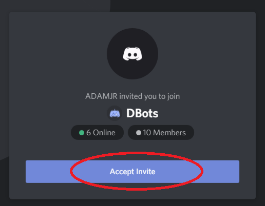
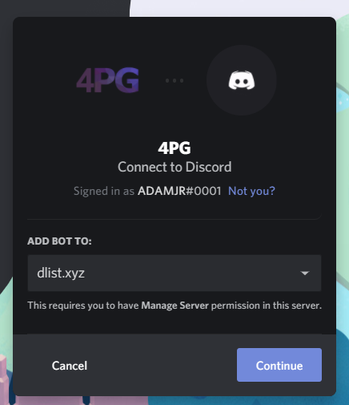
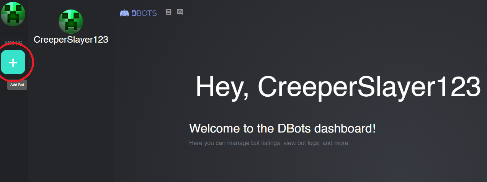
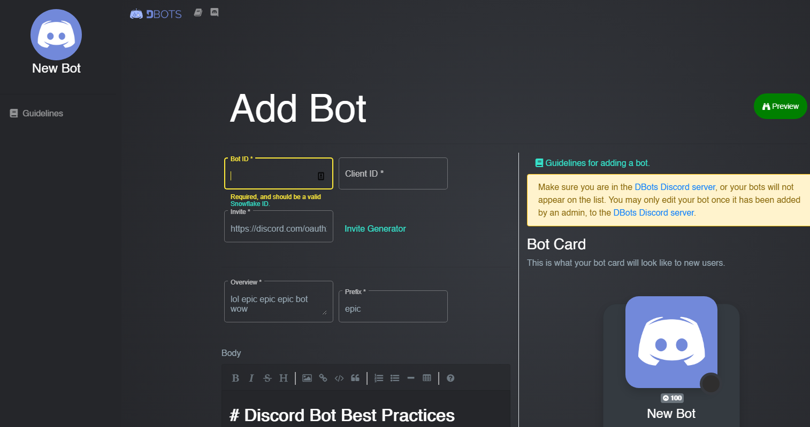

# Get Started

### Step 1

**Join the DBots Server** Make sure you are in the [DBots Discord Server](https://discord.gg/uDTgxyg) to enable you to add a bot.

### Step 2

**Add a Bot** [Login]([https://dbots.co/login) to the DBots Dashboard to your server. This will redirect you to a Discord OAuth2 link which should auto login to DBots, with your currently logged-in Discord account. After logging into the dashboard, you can [add a bot](/dashboard/bots/new) by clicking on the '+' icon.

### Step 3

**Fill in the Form and Post** Fill in the form and post. Your bot has now been added to the approval queue! Please be patient, and if you have correctly followed the [Bot Guidelines](/docs/guidelines) your bot may be accepted.

